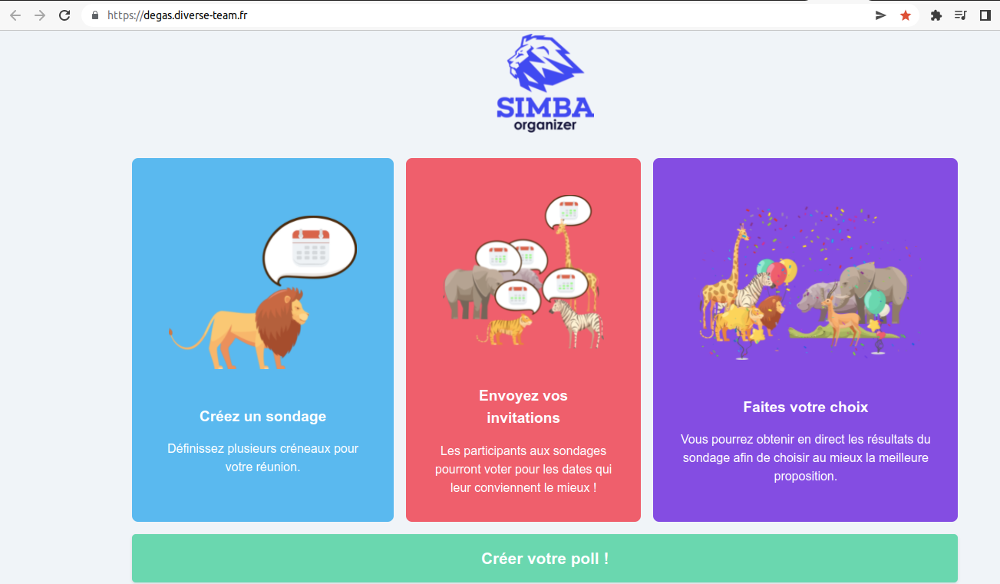
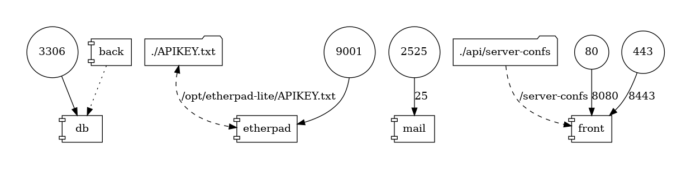

# Remote meetings planning

## Etape 1 - 3 :

Déployé sur une VM de l'istic, application disponible ici [https://degas.diverse-team.fr](https://degas.diverse-team.fr)

## Etape 4 : 

Les 3 éléments de gauche constituent le back, il fonctionnent avec quarkus.io  
Le front en angular se base sur un serveur web nginx

## Etape 5 :